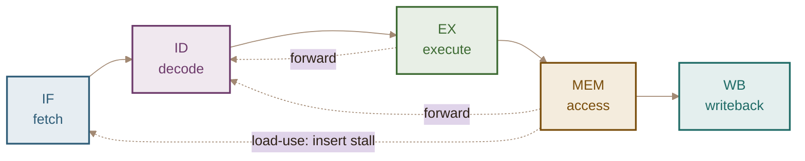
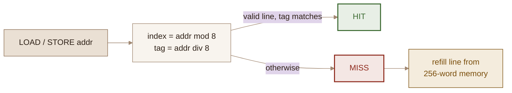

<div align="center">


<br/>


</div>

---

**NOVA-16** is a custom 16-bit RISC architecture and a browser-based emulator for it, built with Flask and vanilla JavaScript. Write assembly in the editor, then run it or step through it one instruction at a time and watch the pipeline, cache, hazard unit, and branch predictor react in real time.

<!-- Drop a screenshot in here once you have one:
<div align="center"></div>
-->

## The pipeline

Every instruction walks the five classic stages. Forwarding paths and stall insertion are detected automatically and drawn as they happen.



## Features

| | |
|---|---|
| **Live assembler & emulator** | Assemble from the editor, then `run` continuously or `step` instruction by instruction at an adjustable speed |
| **Pipeline visualizer** | IF → ID → EX → MEM → WB, each stage showing its current instruction, decoded fields, and raw 20-bit word |
| **L1 data cache** | 8-line direct-mapped, write-through, with per-line tag/value display and hit/miss flashes |
| **RAW hazard detection** | Load-use hazards insert a stall; everything else forwards, and both are reported live |
| **2-bit saturating predictor** | Branch predictions tracked with the counter state (SN/WN/WT/ST) drawn as it saturates |
| **CPI breakdown** | Cycles split into ALU / MEM / Branch / Stall with a live bar chart |
| **Register & memory viewer** | All 16 registers plus 256 memory words, colour-coded for code, stored data, stack, and the current PC |
| **Execution trace** | Every retired instruction with its address, raw encoding, effect, and any hazard tag |
| **AI code generator** | Describe a computation in English and Gemini writes the NOVA-16 assembly — cancellable mid-request |

## Architecture

| Feature | Detail |
|---|---|
| Word size | 16-bit |
| Instruction word | 20-bit |
| Registers | 16 general-purpose (`R0`–`R15`) |
| Memory | 256 words |
| Stack | Hardware stack, `SP` starts at 255 and grows downward |
| Flags | Zero `Z`, Negative `N`, Carry `C`, Overflow `V` |
| Instructions | 24 — ALU, memory, branches, `CALL`/`RET`, `PUSH`/`POP` |
| Cycle costs | ALU 1 · MEM 2 · MUL 3 · Branch 3 · +1 per stall |

**Instruction encoding** — five layouts share the 20-bit word:

```
Register    op(5) | dst(4) | src1(4) | src2(4) | 000
Immediate   op(5) | dst(4) | imm(11 signed)
Reg + imm   op(5) | dst(4) | src1(4) | imm(7 signed)
Store       op(5) | src(4) | addr(8 unsigned)
Jump / Call op(5) | addr(8 unsigned)
```

## Cache lookup



## Quick start

**1. Clone and enter the repo**

```bash
git clone https://github.com/HassanKhalid8/NOVA-16_Enhanced-ISA-Emulator.git
cd NOVA-16_Enhanced-ISA-Emulator
```

**2. Install dependencies**

```bash
pip install -r requirements.txt
```

**3. Add your Gemini API key** (optional — only the AI panel needs it)

Create a `.env` file in the project root:

```
GEMINI_API_KEY=your_key_here
```

Free keys, no credit card, at [aistudio.google.com/app/apikey](https://aistudio.google.com/app/apikey).

**4. Run**

```bash
python app.py
```

Then open **http://127.0.0.1:5000**.

## Instruction set

| Instruction | Effect |
|---|---|
| `LOADI Rd, imm` | `Rd = imm` (−1024…1023) |
| `LOAD Rd, addr` | `Rd = mem[addr]` |
| `STORE Rs, addr` | `mem[addr] = Rs` |
| `ADD Rd, Rs1, Rs2` | `Rd = Rs1 + Rs2` |
| `ADDI Rd, Rs, imm` | `Rd = Rs + imm` (−64…63) |
| `SUB Rd, Rs1, Rs2` | `Rd = Rs1 − Rs2` |
| `SUBI Rd, Rs, imm` | `Rd = Rs − imm` (−64…63) |
| `MUL Rd, Rs1, Rs2` | `Rd = Rs1 × Rs2` |
| `AND` `OR` `XOR` | Bitwise, `Rd = Rs1 ⊕ Rs2` |
| `NOT Rd, Rs` | `Rd = ~Rs` |
| `SHL` `SHR` | `Rd = Rs << n` / `Rs >> n` (n = 0…15) |
| `JUMP addr` | `PC = addr` |
| `JZ` `JNZ` | Jump if `Z` set / clear |
| `JLT` `JGT` | Jump if negative / if positive and non-zero |
| `PUSH Rs` `POP Rd` | Stack push / pop |
| `CALL addr` `RET` | Subroutine call and return |
| `HALT` | Stop execution |

Labels (`LOOP:` … `JUMP LOOP`), hex (`0xFF`), binary (`0b1010`), and `;` comments are all supported.

**Built-in examples:** add numbers · countdown loop · Fibonacci · bubble sort · `CALL`/`RET` · data-hazard demo · bitwise ops.

## AI code generator

Describe a computation and Gemini 2.5 Flash writes the assembly for it:

> *"Compute factorial of 5 and store in mem[0]"*
> *"Sort three values in R0, R1, R2 in ascending order"*
> *"Compute GCD of two numbers using Euclid's algorithm"*

- **Assembly only.** The generator is scoped to NOVA-16 programs — off-topic requests (poems, trivia, other languages) are refused rather than answered, and the server validates that every returned line is a real instruction, label, or comment before it can reach the editor.
- **Cancellable.** A `stop` button appears while a request is in flight; <kbd>Esc</kbd> in the prompt does the same.
- **Ctrl+Enter** generates, and `insert into editor` drops the result straight into the assembler.

## Interface

| Panel | Contents |
|---|---|
| **Left** | Assembly editor, example picker, assemble/step/run/reset controls, speed slider, AI generator |
| **Centre** | 5-stage pipeline, hazard strip, registers, L1 cache, 256-word memory map, execution trace |
| **Right** | CPU state and flags, CPI breakdown, branch predictor, full instruction reference |

## Theme

The interface uses a warm, high-contrast **Rich Brown** palette — every text/background pair meets WCAG AA.

| Swatch | Hex | Role |
|---|---|---|
|  | `#f8f4ee` | Page background |
|  | `#d9c9ba` | Raised surfaces, hover |
|  | `#bba591` | Borders |
|  | `#a28973` | Strong borders, scrollbars |
|  | `#8c6e52` | Primary accent |
|  | `#6e4f32` | Buttons, PC marker, headline values |
|  | `#2e2117` | Body text |

Stage and status colours are earthy variants of the same family: IF `#2f5d78` · ID `#6d3a6b` · EX `#3d6b33` · MEM `#7a4e0c` · WB `#1f6b66` · stall `#8f2b1e`.

## Project structure

```
NOVA-16_Enhanced-ISA-Emulator/
├── app.py                  # Flask backend — routes, Gemini bridge, reply validation
├── nova16_emulator.py      # NOVA-16 CPU core — assembler, cache, hazards, predictor
├── templates/
│   └── index.html          # Entire frontend — editor, visualizer, panels, styling
├── requirements.txt
├── .env                    # GEMINI_API_KEY (gitignored)
└── LICENSE
```

## License

MIT — see [LICENSE](LICENSE).

<div align="center">

</div>
